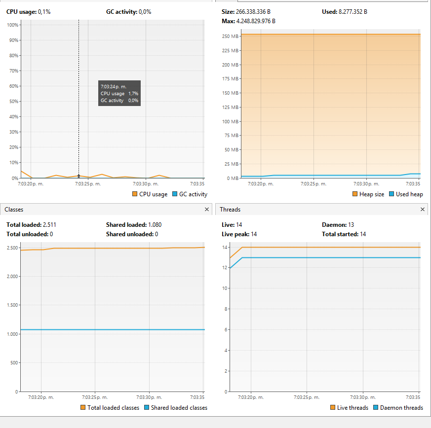
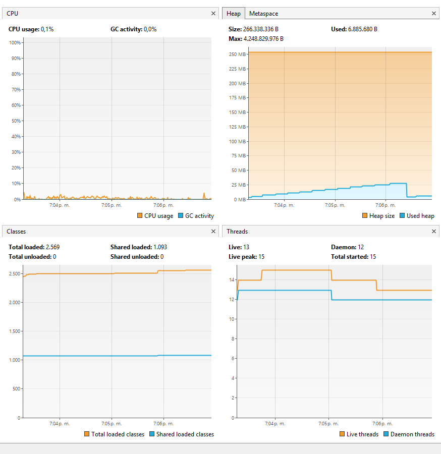
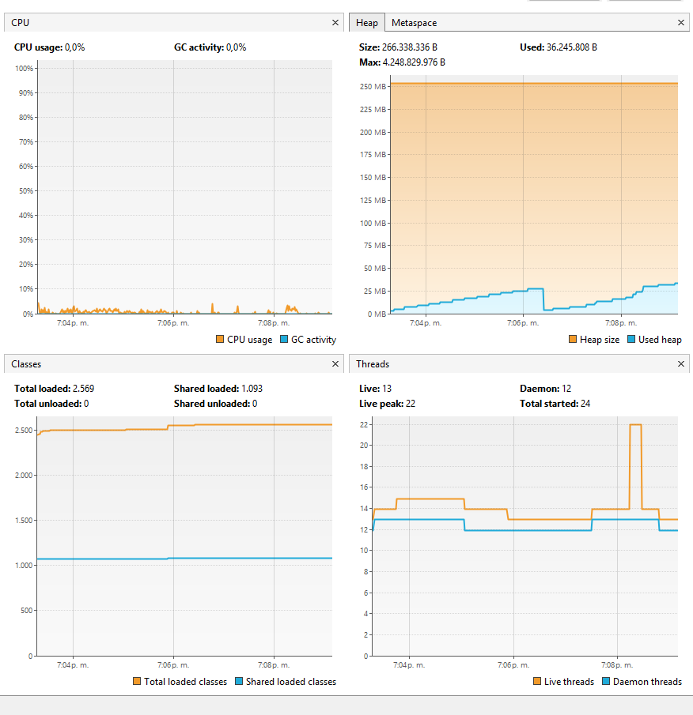
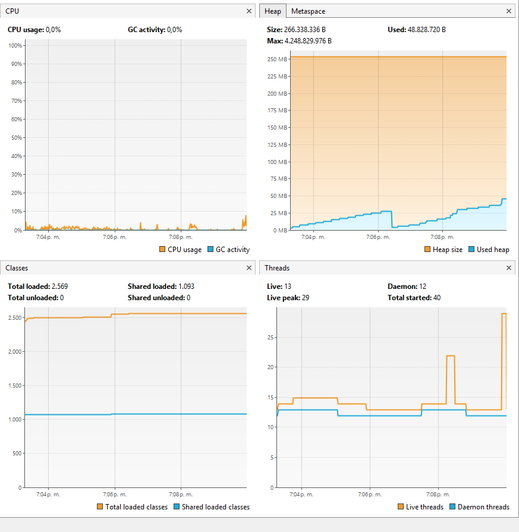
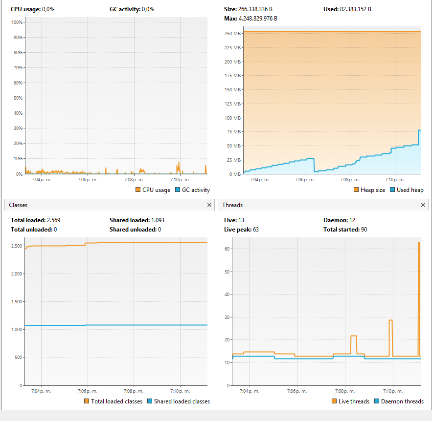
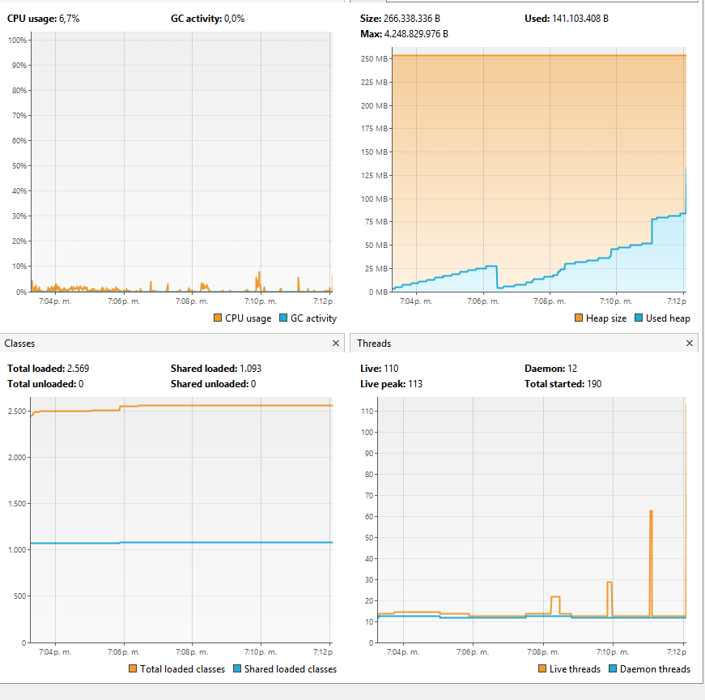
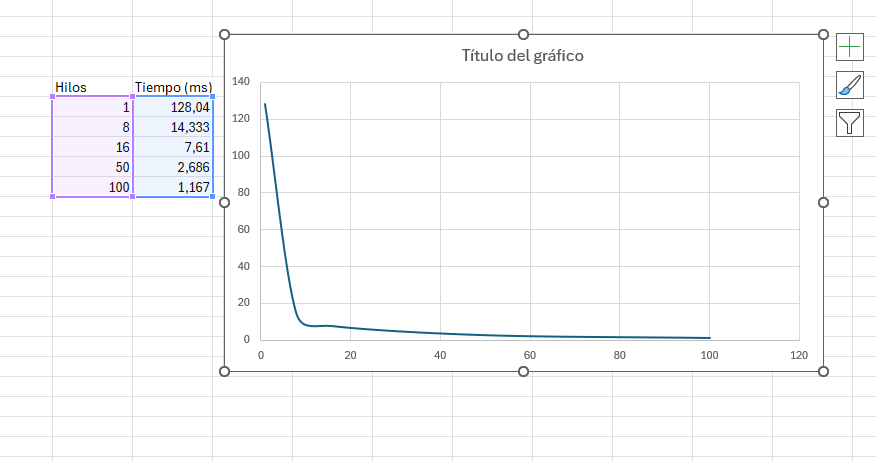

### Escuela Colombiana de Ingeniería
### Arquitecturas de Software - ARSW
## Ejercicio Introducción al paralelismo - Hilos - Caso BlackListSearch

### Autores: 
- Samuel Castelblanco Tellez
- Ángela Sofía Gómez Valencia

### Dependencias:
####   Lecturas:
*  [Threads in Java](http://beginnersbook.com/2013/03/java-threads/)  (Hasta 'Ending Threads')
*  [Threads vs Processes]( http://cs-fundamentals.com/tech-interview/java/differences-between-thread-and-process-in-java.php)

### Descripción
  Este ejercicio contiene una introducción a la programación con hilos en Java, además de la aplicación a un caso concreto.

**Parte I - Introducción a Hilos en Java**

1. De acuerdo con lo revisado en las lecturas, complete las clases CountThread, para que las mismas definan el ciclo de vida de un hilo que imprima por pantalla los números entre A y B.

2. Complete el método __main__ de la clase CountMainThreads para que:
	1. Cree 3 hilos de tipo CountThread, asignándole al primero el intervalo [0..99], al segundo [99..199], y al tercero [200..299].
	2. Inicie los tres hilos con 'start()'.
	3. Ejecute y revise la salida por pantalla. 
	4. Cambie el incio con 'start()' por 'run()'. Cómo cambia la salida?, por qué?.

**Parte II - Ejercicio Black List Search**

Para un software de vigilancia automática de seguridad informática se está desarrollando un componente encargado de validar las direcciones IP en varios miles de listas negras (de host maliciosos) conocidas, y reportar aquellas que existan en al menos cinco de dichas listas. 

Dicho componente está diseñado de acuerdo con el siguiente diagrama, donde:

- HostBlackListsDataSourceFacade es una clase que ofrece una 'fachada' para realizar consultas en cualquiera de las N listas negras registradas (método 'isInBlacklistServer'), y que permite también hacer un reporte a una base de datos local de cuando una dirección IP se considera peligrosa. Esta clase NO ES MODIFICABLE, pero se sabe que es 'Thread-Safe'.

- HostBlackListsValidator es una clase que ofrece el método 'checkHost', el cual, a través de la clase 'HostBlackListDataSourceFacade', valida en cada una de las listas negras un host determinado. En dicho método está considerada la política de que al encontrarse un HOST en al menos cinco listas negras, el mismo será registrado como 'no confiable', o como 'confiable' en caso contrario. Adicionalmente, retornará la lista de los números de las 'listas negras' en donde se encontró registrado el HOST.

Al usarse el módulo, la evidencia de que se hizo el registro como 'confiable' o 'no confiable' se dá por lo mensajes de LOGs:

INFO: HOST 205.24.34.55 Reported as trustworthy

INFO: HOST 205.24.34.55 Reported as NOT trustworthy

Al programa de prueba provisto (Main), le toma sólo algunos segundos análizar y reportar la dirección provista (200.24.34.55), ya que la misma está registrada más de cinco veces en los primeros servidores, por lo que no requiere recorrerlos todos. Sin embargo, hacer la búsqueda en casos donde NO hay reportes, o donde los mismos están dispersos en las miles de listas negras, toma bastante tiempo.

Éste, como cualquier método de búsqueda, puede verse como un problema [vergonzosamente paralelo](https://en.wikipedia.org/wiki/Embarrassingly_parallel), ya que no existen dependencias entre una partición del problema y otra.

Para 'refactorizar' este código, y hacer que explote la capacidad multi-núcleo de la CPU del equipo, realice lo siguiente:

1. Cree una clase de tipo Thread que represente el ciclo de vida de un hilo que haga la búsqueda de un segmento del conjunto de servidores disponibles. Agregue a dicha clase un método que permita 'preguntarle' a las instancias del mismo (los hilos) cuantas ocurrencias de servidores maliciosos ha encontrado o encontró.

2. Agregue al método 'checkHost' un parámetro entero N, correspondiente al número de hilos entre los que se va a realizar la búsqueda (recuerde tener en cuenta si N es par o impar!). Modifique el código de este método para que divida el espacio de búsqueda entre las N partes indicadas, y paralelice la búsqueda a través de N hilos. Haga que dicha función espere hasta que los N hilos terminen de resolver su respectivo sub-problema, agregue las ocurrencias encontradas por cada hilo a la lista que retorna el método, y entonces calcule (sumando el total de ocurrencuas encontradas por cada hilo) si el número de ocurrencias es mayor o igual a _BLACK_LIST_ALARM_COUNT_. Si se da este caso, al final se DEBE reportar el host como confiable o no confiable, y mostrar el listado con los números de las listas negras respectivas. Para lograr este comportamiento de 'espera' revise el método [join](https://docs.oracle.com/javase/tutorial/essential/concurrency/join.html) del API de concurrencia de Java. Tenga también en cuenta:

	* Dentro del método checkHost Se debe mantener el LOG que informa, antes de retornar el resultado, el número de listas negras revisadas VS. el número de listas negras total (línea 60). Se debe garantizar que dicha información sea verídica bajo el nuevo esquema de procesamiento en paralelo planteado.

	* Se sabe que el HOST 202.24.34.55 está reportado en listas negras de una forma más dispersa, y que el host 212.24.24.55 NO está en ninguna lista negra.

**Parte II.I Para discutir la próxima clase (NO para implementar aún)**

La estrategia de paralelismo antes implementada es ineficiente en ciertos casos, pues la búsqueda se sigue realizando aún cuando los N hilos (en su conjunto) ya hayan encontrado el número mínimo de ocurrencias requeridas para reportar al servidor como malicioso. Cómo se podría modificar la implementación para minimizar el número de consultas en estos casos?, qué elemento nuevo traería esto al problema?

**Parte III - Evaluación de Desempeño**

A partir de lo anterior, implemente la siguiente secuencia de experimentos para realizar las validación de direcciones IP dispersas (por ejemplo 202.24.34.55), tomando los tiempos de ejecución de los mismos (asegúrese de hacerlos en la misma máquina):

1. Un solo hilo.
2. Tantos hilos como núcleos de procesamiento (haga que el programa determine esto haciendo uso del [API Runtime](https://docs.oracle.com/javase/7/docs/api/java/lang/Runtime.html)).
3. Tantos hilos como el doble de núcleos de procesamiento.
4. 50 hilos.
5. 100 hilos.

Al iniciar el programa ejecute el monitor jVisualVM, y a medida que corran las pruebas, revise y anote el consumo de CPU y de memoria en cada caso. 

Con lo anterior, y con los tiempos de ejecución dados, haga una gráfica de tiempo de solución vs. número de hilos. Analice y plantee hipótesis con su compañero para las siguientes preguntas (puede tener en cuenta lo reportado por jVisualVM):

Parte IV - Ejercicio Black List Search

1. Según la ley de Amdahls:

, donde S(n) es el mejoramiento teórico del desempeño, P la fracción paralelizable del algoritmo, y n el número de hilos, a mayor n, mayor debería ser dicha mejora. Por qué el mejor desempeño no se logra con los 500 hilos?, cómo se compara este desempeño cuando se usan 200?.

2. Cómo se comporta la solución usando tantos hilos de procesamiento como núcleos comparado con el resultado de usar el doble de éste?.

3. De acuerdo con lo anterior, si para este problema en lugar de 100 hilos en una sola CPU se pudiera usar 1 hilo en cada una de 100 máquinas hipotéticas, la ley de Amdahls se aplicaría mejor?. Si en lugar de esto se usaran c hilos en 100/c máquinas distribuidas (siendo c es el número de núcleos de dichas máquinas), se mejoraría?. Explique su respuesta.

---
## RESPUESTAS LABORATORIO I 

### Parte I - Introducción a los hilos en Java 

> 1. De acuerdo con lo revisado en las lecturas, complete las clases CountThread, para que las mismas definan el ciclo de vida de un hilo que imprima por pantalla los números entre A y B. 

Para esta parte, los integrantes escribieron la clase de CountThread teniendo en cuenta la funciones de start() y run(), las cuales fueron usadas para entender mejor los conceptos de concurrencia. En adición, se utilizó una lógica básica matemática para hacer la división correcta del rango dado en 3 subrangos, independientemente de si el rango es un múltiplo de 3 o no. 

Ahora bien, para poder identificar el orden de la impresión de los diferentes hilos el programa imprime el nombre del hilo con cada número, como se mostró anteriormente. Acá se muestra la lógica del uso de los métodos run() y start(), los cuales son llamados desde el método main. 

Método run() imprime de forma ordenada los números: 

Método start() imprime de forma desordenada los números: 

> 2. Complete el método __main__ de la clase CountMainThreads para que:
	1. Cree 3 hilos de tipo CountThread, asignándole al primero el intervalo [0..99], al segundo [99..199], y al tercero [200..299].
	2. Inicie los tres hilos con 'start()'.
	3. Ejecute y revise la salida por pantalla. 
	4. Cambie el incio con 'start()' por 'run()'. Cómo cambia la salida?, por qué?.

Ahora bien, para poder entender mejor el método de join junto con los métodos previamente utilizados de start() y run(), se utilizó la clase de CountThread1 que contiene los elementos básicos de un thread junto con sus elementos a imprimir, la cual fue usada en la clase de CountThreadsMain. Esta busca comparar los resultados cuando se usa y cuando no se usa la función de join.

A continuación se muestran los resultados de ambos casos: 

### Parte II - Ejercicio Black List Search

> 1. Cree una clase de tipo Thread que represente el ciclo de vida de un hilo que haga la búsqueda de un segmento del conjunto de servidores disponibles. Agregue a dicha clase un método que permita 'preguntarle' a las instancias del mismo (los hilos) cuantas ocurrencias de servidores maliciosos ha encontrado o encontró.

Para esta parte de creó una clase llamada HostBlackSearchThread, la cual permite monitorear y registrar la cantidad de ocurrencias de servidores maliciosos que ha encontrado. Este registro se realiza dentro del método de run(), el cual es repaldado por flags para obtener la cantidad de ocurrencias y la lista de ocurrencias. 

A continuación se muestra la clase del ciclo de vida de los hilos junto con sus flags: 

> 2. Agregue al método 'checkHost' un parámetro entero N, correspondiente al número de hilos entre los que se va a realizar la búsqueda (recuerde tener en cuenta si N es par o impar!). Modifique el código de este método para que divida el espacio de búsqueda entre las N partes indicadas, y paralelice la búsqueda a través de N hilos. Haga que dicha función espere hasta que los N hilos terminen de resolver su respectivo sub-problema, agregue las ocurrencias encontradas por cada hilo a la lista que retorna el método, y entonces calcule (sumando el total de ocurrencuas encontradas por cada hilo) si el número de ocurrencias es mayor o igual a _BLACK_LIST_ALARM_COUNT_. Si se da este caso, al final se DEBE reportar el host como confiable o no confiable, y mostrar el listado con los números de las listas negras respectivas. Para lograr este comportamiento de 'espera' revise el método [join](https://docs.oracle.com/javase/tutorial/essential/concurrency/join.html) del API de concurrencia de Java. Tenga también en cuenta:

> * Dentro del método checkHost Se debe mantener el LOG que informa, antes de retornar el resultado, el número de listas negras revisadas VS. el número de listas negras total (línea 60). Se debe garantizar que dicha información sea verídica bajo el nuevo esquema de procesamiento en paralelo planteado.

> * Se sabe que el HOST 202.24.34.55 está reportado en listas negras de una forma más dispersa, y que el host 212.24.24.55 NO está en ninguna lista negra.

Para esta parte se tuvo en cuenta el uso de la función join(), utilizada previamente en la sección anterior. Acá se editó el método de checkHost de la clase HostBlackListsValidator para poder manejar los casos en donde el parámetro N sea par o impar. En adición e implementa la lógica de distribuir correctamente los hilos dependiendo del espacio muestral que se quiere analizar, se usa la función join() para poder manejar el orden de ejecución de los hilos, para así finalmente añadir las ocurrencias a la lista correspondiente, y así poder identificar si dicha ocurrencia supera el umbral para claisificarlos como confiable o no confiable

Durante todo este proceso se tiene en cuenta el uso del logger para registrar los datos en cuenta a las listas negras junto con el númer de lista negras en total. 

A continuación se muestran los resultados de dos ejemplos: uno donde la dirección IP es confiable y otra dirección que no es confiable al aparecer en 5 o más listas negras. 

### Parte II.I - Terminación temprana

> La estrategia de paralelismo antes implementada es ineficiente en ciertos casos, pues la búsqueda se sigue realizando aún cuando los N hilos (en su conjunto) ya hayan encontrado el número mínimo de ocurrencias requeridas para reportar al servidor como malicioso. ¿Cómo se podría modificar la implementación para minimizar el número de consultas en estos casos?, ¿qué elemento nuevo traería esto al problema?

Se podría agregar una bandera compartida entre los hilos, algo como un AtomicBoolean (o un volatile boolean), que funcione como señal de "ya párenle todos". La idea es que cada hilo, antes de ir a consultar la siguiente lista negra, primero mire esa bandera. Si ya está en true, simplemente no sigue buscando.

El que prende dicha bandera es el hilo que note que el contador de ocurrencias (que ya se está llevando de forma segura, con synchronized o con AtomicInteger) llegó al BLACK_LIST_ALARM_COUNT. En ese momento la pone en true, y como todos los demás la están chequeando constantemente, los otros hilos van a ir cortando su búsqueda apenas se den cuenta.

Ahora, esto puede provocar una nueva desventaja: sincronización entre hilos. Este puede generar los siguientes inconvenientes: 

Hay que coordinar quién lee y quién escribe esas variables compartidas, lo que mete contención (o sea, hilos esperándose entre ellos por el acceso).
Se genera un trade-off: uno se ahorra consultas innecesarias, pero paga con el overhead que meten synchronized o los átomos.
Y lo más importante: la ganancia real depende de qué tan repartidas estén las ocurrencias en las listas. Si resulta que todas las coincidencias están casi al final, la bandera se prende tarde y prácticamente no se ahorra nada — en el peor caso, es como si no hubiéramos hecho el cambio.

## Parte III — Evaluación de Desempeño

> A partir de lo anterior, implemente la siguiente secuencia de experimentos para realizar las validación de direcciones IP dispersas (por ejemplo 202.24.34.55), tomando los tiempos de ejecución de los mismos (asegúrese de hacerlos en la misma máquina):
> - Un solo hilo.
> - Tantos hilos como núcleos de procesamiento (haga que el programa determine esto haciendo uso del API Runtime).
> - 50 hilos.
> - Tantos hilos como el doble de núcleos de procesamiento.
> - 100 hilos.

**Máquina:** 8 núcleos | **IP de prueba:** `202.24.34.55` (dispersa, encontrada en 5 listas negras)

### Estado inicial (antes de ejecutar)

| Métrica | Valor |
|---------|-------|
| Threads activos | 14 |
| CPU | En reposo |
| Heap | ~26 MB (base) |

### Tabla de resultados por configuración

| # | Hilos | Tiempo (ms) | Speedup vs 1 hilo | CPU pico (%) | Heap usado | Threads totales | Captura jVisualVM |
|---|-------|------------|-------------------|-------------|------------|-----------------|-------------------|
| 1 | 1     | 128,039.81 | 1.00×             | 4.3%        | 26 MB      | 15              |  |
| 2 | 8     | 14,333.37  | 8.93×             | 3.6%        | 34 MB      | 22              |  |
| 3 | 16    | 7,610.05   | 16.82×            | 8.2%        | 50 MB      | 29              |  |
| 4 | 50    | 2,686.30   | 47.67×            | 5.9%        | 86 MB      | 63              |  |
| 5 | 100   | 1,167.46   | 109.67×           | 6.0%        | 135 MB     | 115             |  |

### Observaciones

- **Speedup casi lineal** hasta 16 hilos (2× núcleos), lo cual es excepcional y sugiere que el problema está más limitado por I/O que por CPU. La fachada `HostBlacklistsDataSourceFacade` internamente simula latencia de consulta, lo que permite que más hilos aprovechen el tiempo de espera.
- **CPU nunca llegó al 100%** (máximo 8.2%), confirmando que el cuello de botella no es cómputo puro sino el mecanismo interno de la fachada.
- **Memoria heap crece linealmente** con el número de hilos (cada hilo crea su propia `LinkedList` de resultados), pero se mantiene en rangos manejables (< 200 MB).
- **Threads totales** = hilos de prueba + hilos de JVM (GC, monitoreo, etc.). La diferencia es consistente (~13-15 hilos base).

### Gráfica

> Con lo anterior, y con los tiempos de ejecución dados, haga una gráfica de tiempo de solución vs. número de hilos. Analice y plantee hipótesis con su compañero para las siguientes preguntas (puede tener en cuenta lo reportado por jVisualVM):

Con estos datos se debe construir una gráfica **Tiempo de ejecución vs. Número de hilos**. La curva resultante muestra un descenso pronunciado al inicio que se va aplanando — comportamiento típico de la Ley de Amdahl.

---

# Parte IV — Ley de Amdahl y desempeño

## 1. ¿Por qué el mejor desempeño no se logra con los 500 hilos? ¿Cómo se compara con 200?

La ley de Amdahl dice básicamente que no importa cuántos hilos le metamos, el speedup siempre va a estar topado por la parte del algoritmo que no se puede paralelizar. Ese techo nunca se rompe, sin importar qué tan potente sea la máquina o cuántos hilos lancemos.

Ahora, en la práctica, meter demasiados hilos trae sus propios problemas, y por eso 500 termina siendo contraproducente:

- Crear y destruir 500 hilos no es gratis. Cada uno necesita su propio stack (en la JVM, más o menos 1 MB por hilo), así que solo en stacks ya estamos hablando de cerca de 500 MB, sin contar el tiempo que toma inicializarlos todos.
- Con 500 hilos repartiéndose unas 80,000 listas, a cada uno le tocan apenas unas 160. El sistema operativo termina gastando más tiempo cambiando de un hilo a otro que realmente procesando algo.
- Entre más hilos, más pelea por la caché (L1, L2, L3), lo que genera ese fenómeno de cache thrashing que hace todo más lento.
- En algún punto la curva se invierte: agregar más hilos ya no ayuda, empeora el tiempo.

Ahora bien, algo curioso pasó en nuestro experimento: el speedup siguió subiendo hasta los 100 hilos, llegando a 109.67×. Esto no contradice a Amdahl, lo que pasa es que el problema no es puramente de cómputo (CPU-bound). La fachada `HostBlacklistsDataSourceFacade` simula una latencia cada vez que se hace una consulta (`isInBlackListServer`), entonces los hilos se la pasan bastante tiempo esperando — eso es más comportamiento de un problema I/O-bound. Cuando pasa eso, tener más hilos ayuda porque mientras unos esperan, otros pueden seguir trabajando, y el speedup puede terminar siendo mayor incluso que el número de núcleos que tenemos físicamente.

Con 200 hilos probablemente la mejora ya se empieza a sentir más chiquita comparada con el salto de 50 a 100 (el speedup marginal baja). Y con 500, el overhead de crear tantos hilos y el context switching ya empiezan a pesar más que cualquier beneficio, así que el tiempo termina siendo peor que con 100 o 200.

> 2. ¿Cómo se compara usar tantos hilos como núcleos frente a usar el doble?

Con 8 núcleos, esto fue lo que encontramos:

| Configuración | Tiempo (ms) | Speedup |
|--------------|------------|---------|
| 8 hilos (N)   | 14,333     | 8.93×   |
| 16 hilos (2N) | 7,610      | 16.82×  |

Duplicar los hilos casi partió el tiempo a la mitad, lo que da un speedup adicional de casi el doble. Esto llama la atención porque en un problema puramente de cómputo no debería pasar así — si no hay más núcleos disponibles, agregar más hilos de los que hay núcleos normalmente no debería traer mucha ganancia. Pero como la fachada simula latencia, los 16 hilos logran aprovechar esos tiempos muertos de espera mucho mejor que 8.

La conclusión aquí es que el speedup depende muchísimo del tipo de problema que se tiene enfrente. Si hay latencia de por medio (red, I/O, algún sleep simulado), duplicar los hilos puede dar ganancias bien importantes aunque no se dupliquen los núcleos físicos.

> 3. ¿Se aplicaría mejor Amdahl usando 1 hilo por máquina en 100 máquinas? ¿Y usando c hilos en 100/c máquinas?
**100 máquinas, 1 hilo cada una:** sí, aquí Amdahl se cumpliría de forma mucho más limpia, porque:

- Cada máquina tiene su propia CPU, su propia memoria y su propia caché, así que no hay ese problema de recursos compartidos peleándose entre sí.
- Tampoco existe el overhead de context switching que sí se da cuando varios hilos comparten una misma máquina.
- El speedup se acercaría bastante al ideal teórico, limitado casi únicamente por la parte secuencial del algoritmo (P) y por la latencia de red necesaria para repartir el trabajo y juntar los resultados al final.
- Como consultar las listas negras es una tarea que se paraleliza casi al 100%, con 100 máquinas el speedup teórico se acercaría bastante a 100×.

**c hilos en 100/c máquinas:** también mejoraría bastante respecto a tenerlo todo en una sola máquina. Las ventajas son parecidas:

- Ya no hay tanta pelea por CPU y caché entre máquinas distintas, porque cada una solo maneja sus propios c hilos.
- Los hilos de una máquina no interfieren con los de otra.
- Lo único nuevo que aparece es la latencia de red para repartir el trabajo y consolidar resultados. Esto es un factor secuencial extra que Amdahl no contempla directamente, pero en la práctica suele ser bastante pequeño comparado con lo que se gana al eliminar el context switching masivo.

En resumen: repartir el trabajo entre varias máquinas escala mejor que meter un montón de hilos en una sola, porque se elimina el cuello de botella del context switching y la pelea por recursos compartidos, a cambio de una latencia de red que normalmente es menor comparada con el beneficio que se obtiene.

## Referencias

- Amdahl, G. M. (1967). Validity of the single-processor approach to achieving large scale computing capabilities. *AFIPS Conference Proceedings, 30*, 483–485. https://doi.org/10.1145/1465482.1465560

- Goetz, B., Peierls, T., Bloch, J., Bowbeer, J., Holmes, D., & Lea, D. (2006). *Java concurrency in practice*. Addison-Wesley.

---